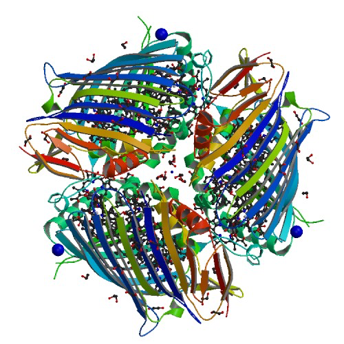

@import "{{ site.theme }}";
# CS205 Final project
Florian Hase, Hannah Sim, and Teresa Tamayo
# Implementation and parallelization of Redfield equations

In this project, we are going to implement and parallelize a 
method for computing the time evolution of the density matrix in an open quantum, 
the Redfield method. This method applies to some photosynthetically active protein complexes[1,2]. 

The Theoretical and Physical Chemistry group of Prof. Alan Aspuru-Guzik, 
has wide experience in the field, where they have studied the
exciton energy transfer in diverse systems.

## <i class="fa fa-check-square" aria-hidden="true"></i> Redfield method

The evolution of small systems is usually influenced by the interaction of the surroundings, 
given that in general is impossible to isolate it. Hence, the dynamics of a quantum system depends 
substantially on the interaction of the external environment. 
However, we are usually unable to keep track the evolution of the complete systems and their surroundings. 
In this situation, we use equations that account the influence of the surroundings on the systems, 
but not keeping track the environment evolutions. 
These ubiquitous phenomena determine the physics and chemistry in diverse fields, one of the most important is the exciton transfer dynamics[1],
One way to describe these dynamics is to utilize the Redfield master equations, where we assume that the transport is a dissipative dynamics for the reduced excitonic density matrix[3,4]. This model considers the interactions between the environment and the system weak and that the system depends only on its present state. 

The first term takes into account the evolution of the system without the presence of the environment, 
while the second keeps track on the environmental influence of the system[3,4]. Solving this equation involves
some matrices operations in large matrices, and parallelization in needed to have a better
representation of the system.

## <i class="fa fa-check-square" aria-hidden="true"></i>  Previous implementations
There are a wide variety of methods that can obtain the exciton dynamics, some of them
departs on the Redfield equations.

## <i class="fa fa-check-square" aria-hidden="true"></i>  Methodology
Our first approach will be implement a serial version of the
solver with a variety of numerical implementations to
perform the time propagations, including different numbers 
of vibrational states in the bath.
Later, we explore different parallelization schemes
with hybrid architectures.

## <i class="fa fa-check-square" aria-hidden="true"></i>  References
[1] P. Rebentrost, R. Chakraborty, and A. Aspuru-Guzik, *J. Chem. Phys*, **131**, 184102 (2009).
[2] P., M. Mohseni, I. Kassal, S. Lloyd, and A. Aspuru-Guzik, *New Journal of Physics*, **11**, 033003 (2009).
[3] V. May and O. Kühn, *Charge and Energy Transfer Dynamics in Molecular Systems*, Wiley, New York, 2004. 
[4] H. P. Breuer, and F. Petruccione, *The theory of open quantum systems*, Oxford, New York, 2010.
[5] C. Kreisbeck and T. Kramer, *J. Phys. Chem.* **3**, 2828, (2011).
[6] C. Kreisbeck and T. Kramer "Exciton Dynamics Lab for Light-Harvesting Complexes (GPU-HEOM)," https://nanohub.org/resources/gpuheompop, (DOI: 10.4231/D3QB9V630), (2014).
